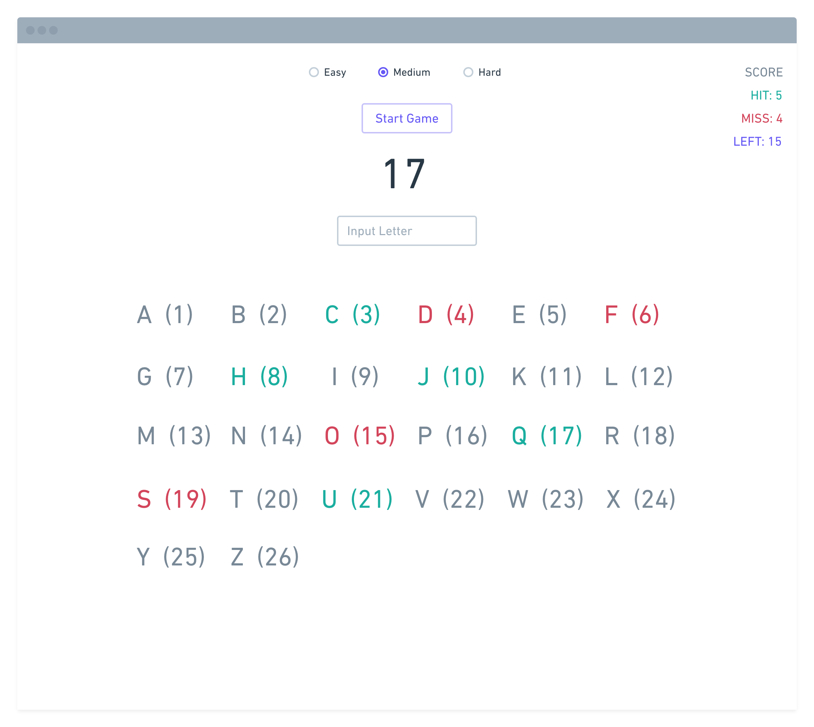

# Zadatak 2: Typing game

**Create an alphabet reflex game based on the attached mockup.**

When user starts a game it should set off the counter that will randomly switch numbers between 1-26. 

Before starting user will have an option to switch between difficulties: *Easy* has timeout between switching 5000ms, *medium* 3500ms and *hard* 2000ms. 

While the number is shown in the center, user needs to input the letter that is mapped to the according number. If inputed letter matches the number that its mapped to, letter will change color to green. If inputed letter does not match or nothing is inputed, corresponding letter will turn red. 

Goal of the game is to match all the letters with corresponding numbers.  Score in the top right corner should be updated automatically.

While game is in progress, button that starts the game will change text to “stop” and can stop and reset the game so user can restart it. Also, difficulty switch should be disabled while in progress. 

Tips: 

- Letter input should happen on keypress.
- When making a random counter function keep in mind not to have duplicated numbers in one gameplay.
- Task should be done in vanilla JS. It should be optimized from Chrome, so most of the new JS syntax can be used. 

We don’t care about the design and styling. Attached screen is only a mockup. You can change the layout if needed, and use any of the CSS frameworks or themes.
